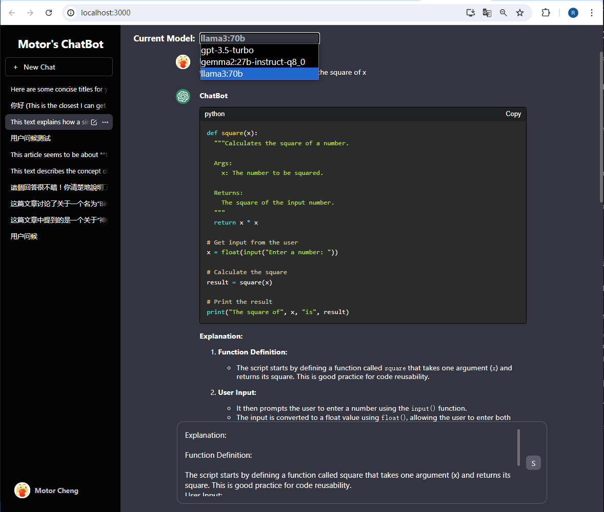

# React-Chatbot

Clone of ChatGPT as a practice for learning front-end things.

To use: Add your openAI API key and MongoDB key into ".env.example" and rename it into ".env". Then run "node index.js" in root path and open another terminal then run "cd client" then "npm start". Remember to install related packages before you run the project. Enjoy~

## Involved Tools

React

MongoDB

Express

## Development Progress

### Done

Basic UI

Basic chat function

View and continue previous conversation

### On Going

Edit Title/Category

Delete Conversation

Model Switch

Copy2Clipboard

Regenerate and Branching

Catergory View in Sidebar

Category recommandations

Visual Branch Management